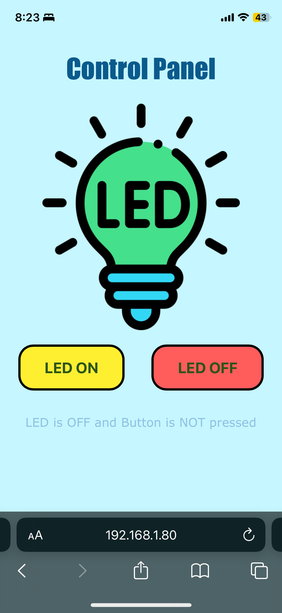
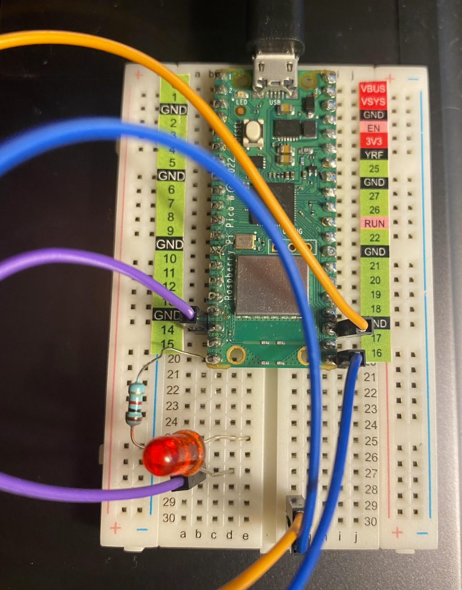
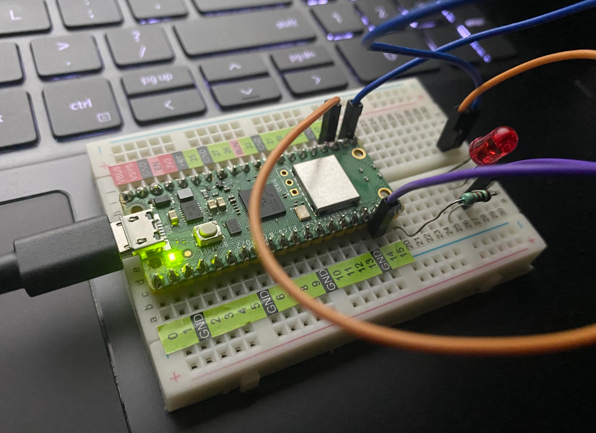
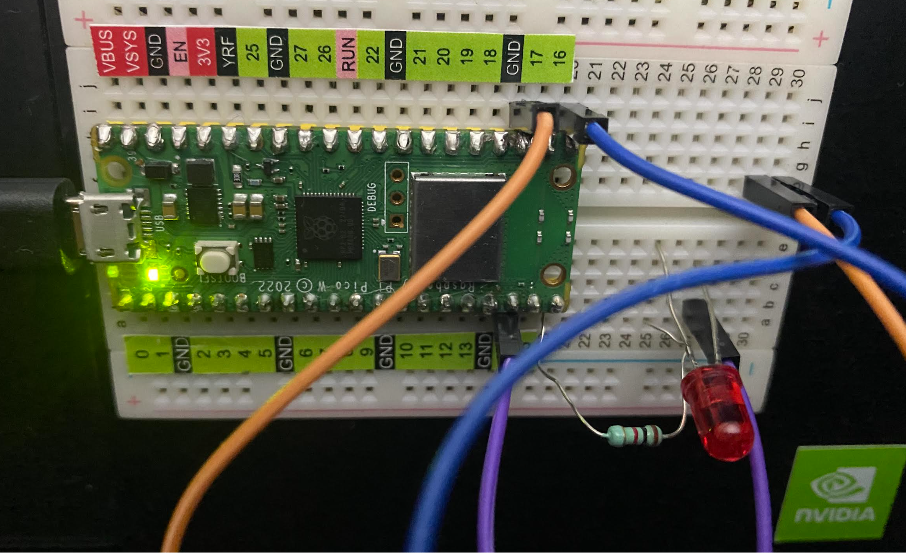

# Practica-2.5

### *Embeded Web Server PicoW (prender / apagar BLINK Led Interno via WEB)*

El ambiente en el que se realizó fue en Thonny con Micropython, haciendo uso de la Pico W.
_Se utilizaron los componentes necesarios para encender el led que tare integrado la Pico por medio_
_haciendo uso de la Pico W, un protoboard, jumpers, un cable micro usb, 1 resistencia y un led_

**Código**
```python
# #Jiménez Rivera Paulina 20211796

#librerías importadas
import time
import network
import socket
from machine import Pin

#objeto led de la Pico W
led = machine.Pin("LED", machine.Pin.OUT)
ledState = 'LED State Unknown' #estado del led

#Objeto boton con el pin correspondiente
button = Pin(16, Pin.IN, Pin.PULL_UP)

ssid = 'INFINITUMA4A3_2.4' #nombre de la red wifi
password = 'YEC4oXXJN9' #contraseña de la red wifi

#configurar y controlar interfaz de red inalámbrica
wlan = network.WLAN(network.STA_IF)
wlan.active(True)
wlan.connect(ssid, password) #recibe el nombre y contraseña de red

#Código en html del diseño de la interfaz que se despliega en el teléfono
#personalización de botones, colores, imágenes, letras, etc.
html = """
<!DOCTYPE html>
<html>
<head>
    <meta name="viewport" content="width=device-width, initial-scale=1">
    <link rel="icon" href="data:,">
    <style>
        body {
            font-family: "Verdana", sans-serif; /* Cambiar el tipo de letra del cuerpo del documento */
            text-align: center;
            background-color: #C6F6FF;
            color: #8CC1E3;
        }
        .buttonGreen, .buttonRed {
            background-color: #FFEF31;
            border: 3px solid #000000;
            color: #2b5419;
            padding: 15px 32px;
            font-size: 20px; /* Aumentar el tamaño de fuente para los botones */
            font-weight: bold; /* Hacer el texto de los botones más grueso */
            margin: 15px;
            cursor: pointer;
            border-radius: 20px;
        }
        .buttonRed {
            background-color: #ff5c5c; /* Cambiar el color de fondo del botón rojo */
        }
        h1 {
            font-family: "Impact", sans-serif; /* Cambiar el tipo de letra del encabezado h1 */
            font-size: 36px; /* Aumentar el tamaño de fuente del encabezado */
            color: #0B5A8D; /* Cambiar el color de letra del encabezado */
        }
    </style>
</head>
<body>
    <h1>Control Panel</h1>
    
    <form>
        <button class="buttonGreen" name="led" value="on" type="submit">LED ON</button>
        <button class="buttonRed" name="led" value="off" type="submit">LED OFF</button>
    </form>
    <p>%s</p>
</body>
</html>
"""

# Esperar para conectar o fallar
max_wait = 10 #tiempo de espera máximo

while max_wait > 0: #ciclo mientras
    if wlan.status() < 0 or wlan.status() >= 3:
        break
    max_wait -= 1
    print('waiting for connection...')
    time.sleep(1)
    
# Manejo de error en conexión
if wlan.status() != 3:
    raise RuntimeError('network connection failed')
else:
    print('Connected')
    status = wlan.ifconfig()
    print( 'ip = ' + status[0] )
    
# Abrir conexión
addr = socket.getaddrinfo('0.0.0.0', 80)[0][-1] # toma la dirección ip del ciente y el puerto
s = socket.socket()
s.bind(addr)
s.listen(1)
print('listening on', addr)

# Escuchar las conexiones, servir al cliente 
while True:
    try:       
        cl, addr = s.accept()
        print('client connected from', addr)
        request = cl.recv(1024)
        print("request:")
        print(request)
        request = str(request)
        led_on = request.find('led=on')
        led_off = request.find('led=off')
        
        print( 'led on = ' + str(led_on))
        print( 'led off = ' + str(led_off))
        
        if led_on == 8:
            print("led on")
            led.value(1)
        if led_off == 8:
            print("led off")
            led.value(0)
        
        ledState = "LED is OFF" if led.value() == 0 else "LED is ON" # sentencia if-else
        
        if button.value() == 1: # botón no presionado
            print("button NOT pressed")
            buttonState = "Button is NOT pressed"
        else:
            print("button pressed")
            buttonState = "Button is pressed"
        
        # Crear y mandar respuesta
        stateis = ledState + " and " + buttonState
        response = html % stateis
        cl.send('HTTP/1.0 200 OK\r\nContent-type: text/html\r\n\r\n')
        cl.send(response)
        cl.close()
        
        # Excepción para cerrar la conexión
    except OSError as e:
        cl.close()
        print('connection closed')
```

Video de funcionamiento

[](https://www.youtube.com/watch?v=Zg2advtpqTI&feature=youtu.be&ab_channel=PAULINAJIMENEZRIVERA)

****Diseño de interfaz:**
Al momento de ejecutar se depsliega una IP, la cual se ingresará al teléfono y de esta manera se presentará
la siguiente interfaz personalizada



Led de la Pico apagado:


Led de la Pico encendido:


